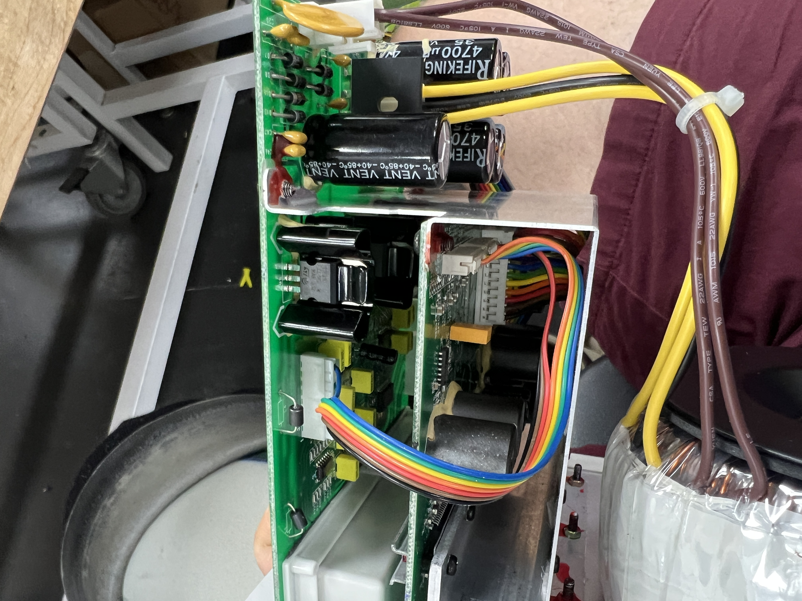
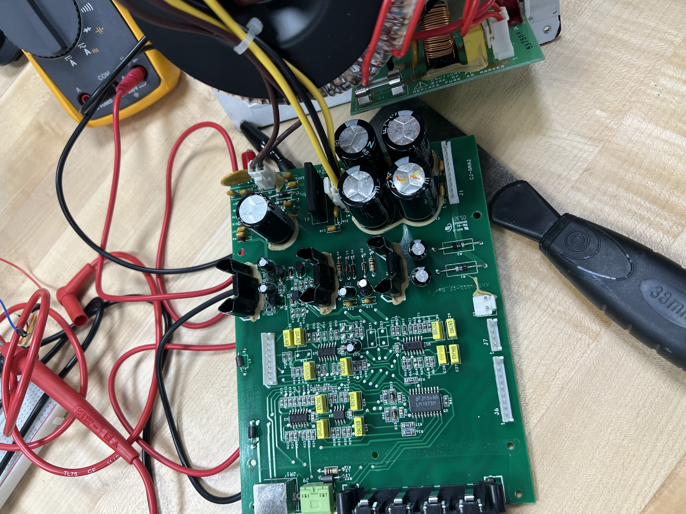
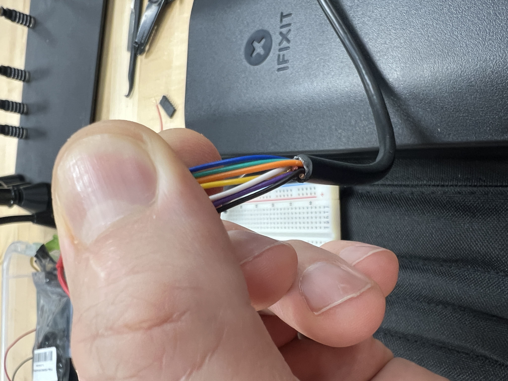
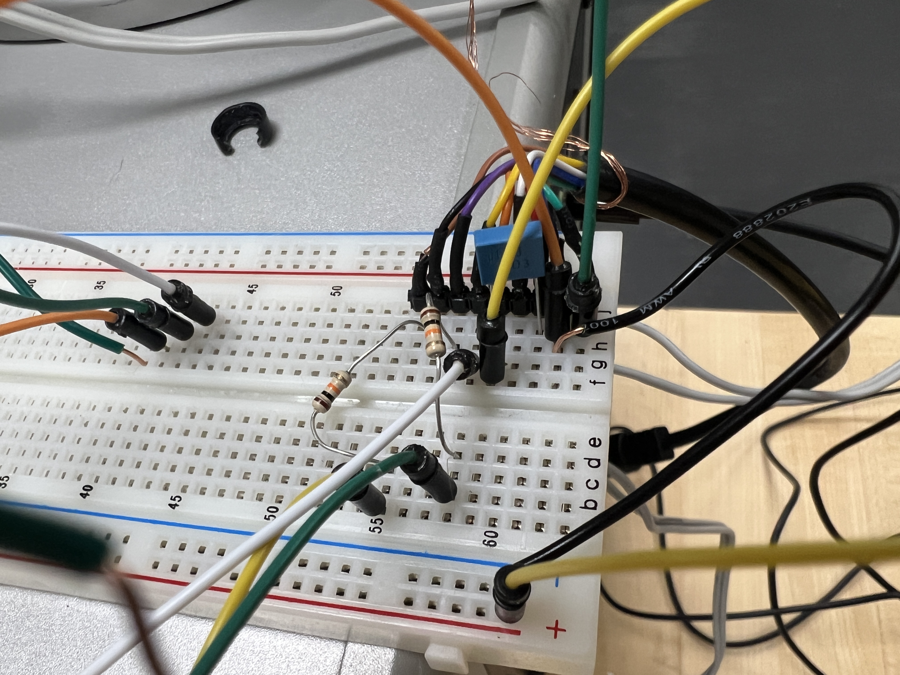
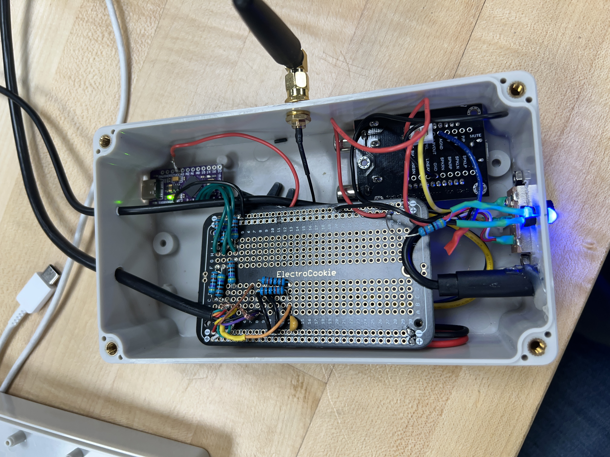
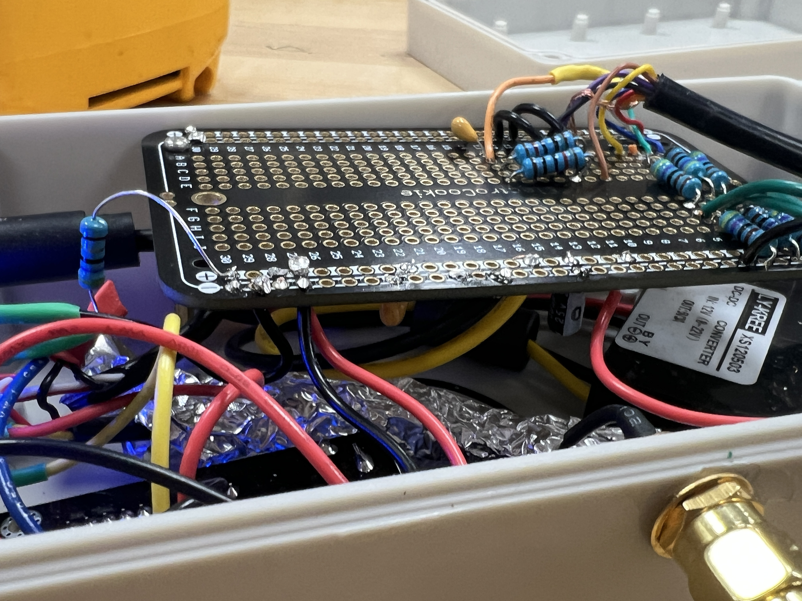
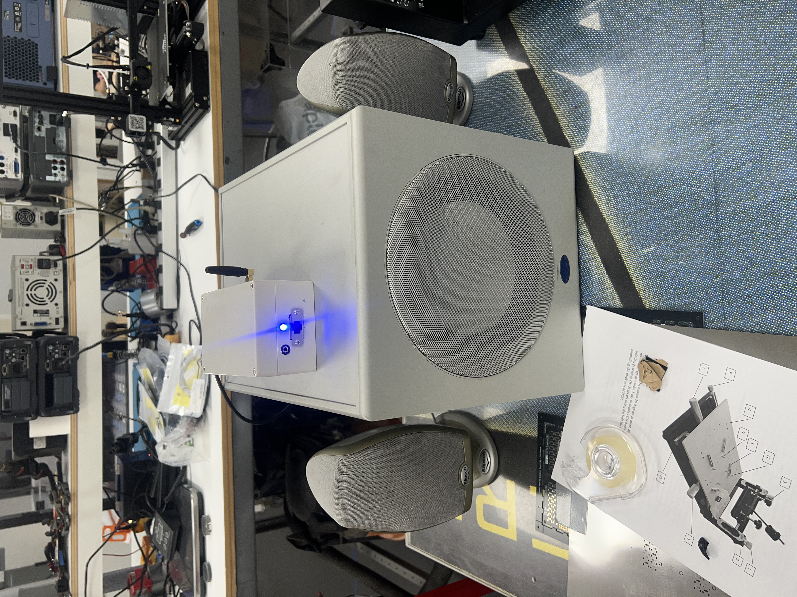
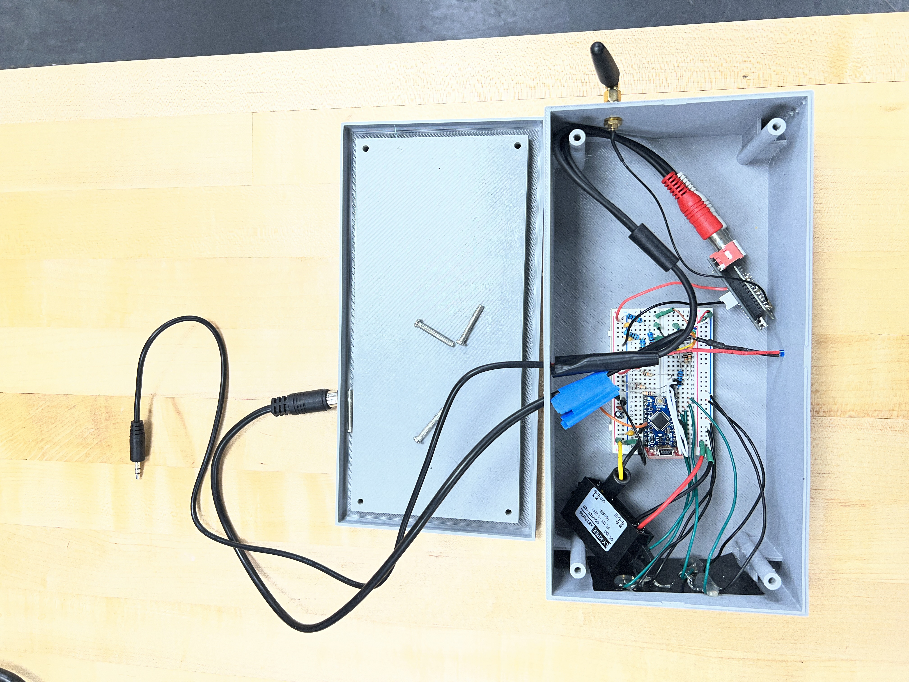
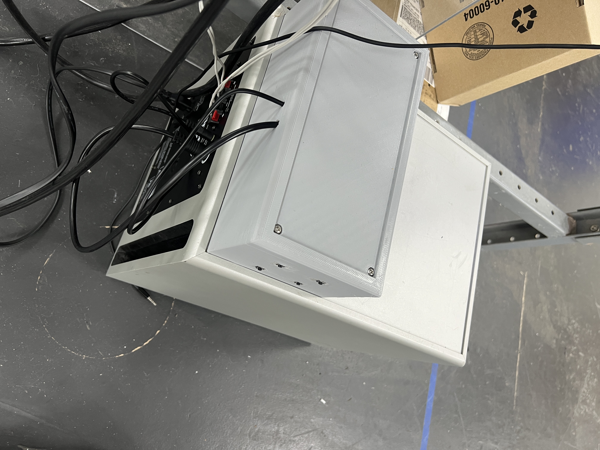

# Klipsch iFi Resurrection  
### Salvaging a Klipsch iFi 2.1 System & Adding Bluetooth

---

## Summary

This project revives a broken Klipsch iFi 2.1 speaker system whose proprietary iPod dock failed, rendering the entire system unusable. By emulating the dock’s logic using a simple microcontroller and discrete components, the system powers on and functions normally again.

Bluetooth audio support was added as a modern input, restoring full usability while preserving the system’s original (and still outstanding) sound quality.

This repository contains:
- Arduino firmware
- Hardware wiring details
- Reference documentation
- STL files for a custom 3D-printed enclosure
- Build photos from two hardware revisions

---

## Background

I’ve been hauling this Klipsch iFi system around since mid-2006. I originally intended to buy a Bose SoundDock, but a Best Buy salesman directed me toward the Klipsch instead. It was more expensive (about $100 more), and far heavier, but sounded dramatically better. And it got LOUD.

The system followed me across continents. Fans of *Club Jesuitenfahrt 7* in Amberg, Germany would dance and drank the night away to these speakers.

Eventually, the proprietary dock became the system’s Achilles’ heel. Newer iPhones no longer fit properly, and when the dock finally failed electrically, the entire subwoofer refused to power on—even when using the auxiliary input. Without a working dock, the system was bricked.

There is no public documentation on how to repair or bypass this dock logic. This was a one-off product for Klipsch, and very little information was ever released.

Using modern LLMs, I was finally able to identify the key control IC (LM1973) and replicate the dock’s behavior externally. This repository documents that solution.

---

## Repository Structure

```text
Klipsch_iFi_Resurrection/
│
├── klipsch_reviver/
│   └── klipsch_reviver.ino
│
├── case_stil_files/
│   ├── Klipsch_Case_Base.stl
│   └── Klipsch_Case_Cover.stl
│
├── pictures/
│   ├── DIN-9_mockup.JPG
│   ├── DIN-9_wires.JPG
│   ├── main_board.JPG
│   ├── sub_insides.JPG
│   ├── v1.JPG
│   ├── v1_closeup.JPG
│   ├── v1_on.JPG
│   ├── v2.JPG
│   └── v2_connections.JPG
│
├── DIN-9 Pinout.pdf
├── LM1973_info.pdf
└── README.md
```

---

## Bill of Materials (BOM)

| Qty | Component | Link to Example |
|----:|----------:|----------------:|
| 1 | Arduino-compatible 5 V microcontroller | |
| 2 | 100 kΩ resistors | |
| 6 | 10 kΩ resistors | |
| 2 | 100 Ω resistors | |
| 1 | 1 kΩ resistor | |
| 1 | 10 µF electrolytic capacitor | |
| 2 | 0.1 µF ceramic capacitors | |
| 1 | 47 nF ceramic capacitor | |
| 2 | 1 nF ceramic capacitors | |
| 1 | Male DIN-9 cable | |
| 1 | 12 V → 5 V buck converter | |
| 4 | Normally-open momentary push buttons | |
| 1 | LED (power indicator) | |
| 1 | Breadboard | |
| 1 | Ferrite core | |
| 1 | Project enclosure | |

**Optional (but recommended):**
- Bluetooth audio module (with external antenna connector)
  - Sub example
- Bluetooth antenna
  - Antenna Link
- RCA-to-3.5 mm or 3.5 mm-to-3.5 mm audio cable
  - RCA link

---

## Procedure

### 0) Optional: Inspect the Subwoofer Internals



  

I initially opened the subwoofer to understand the signal flow and verify component health—especially the LM1973 digital volume control IC that the dock communicates with.

In hindsight, this step was unnecessary; all internal components were functional.

**Warning:** The subwoofer contains large capacitors capable of delivering a severe shock. If opening:
- Unplug and allow the unit to sit for several hours
- Discharge large capacitors with an insulated tool
- Avoid touching exposed circuitry

---

### 1) Prepare the DIN-9 Cable



  

Cut the DIN-9 cable approximately 12 inches from the male plug. Strip the outer sheath to expose:
- 9 internal conductors
- Foil shielding
- Bare braided ground wire

Keep exposed wire lengths as short as possible to minimize noise.

Use a multimeter to identify each conductor’s pin. Do **not** rely on wire colors.  
Reference: `DIN-9 Pinout.pdf`

#### Pin Mapping

| Pin | Function |
|----:|----------|
| 1 | LM1973 CLK |
| 2 | LM1973 DATA |
| 3 | 2.5 V logic |
| 4 | LM1973 LATCH |
| 5 | 12 V supply |
| 6 | Logic ground |
| 7 | Chassis ground |
| 8 | Sense A |
| 9 | Sense B |

---

### 2) Sense Wake & Power Enable

- Connect Pin 8 → Pin 3 through **100 Ω**
- Connect Pin 8 → Pin 6 (GND) through **100 kΩ + 1 nF**
- Repeat for Pin 9

At this point, the sub should power on (audible relay click and faint hum).  
Turn off before proceeding.

---

### 3) Power Regulation

- Feed Pin 5 (12 V) into the buck converter
- Generate a clean 5 V rail
- Add between the 5V rail and ground:
  - 10 µF electrolytic capacitor (polarity matters!)
  - 0.1 µF ceramic capacitor
- Wrap a ferrite core around the buck output leads

---

### 4) LM1973 Digital Control

Reference: `LM1973_info.pdf`

To generate 2.5 V logic from Arduino GPIO, use 10 kΩ / 10 kΩ voltage dividers. That means connect each of the indicated DIN pins to ground via a 10 kΩ resistor, and also connect it to the indicated Arduino pins through 10 kΩ resistors.

| DIN Pin | Arduino Pin |
|--------:|------------:|
| CLK | D4 |
| DATA | D3 |
| LATCH | D2 |

---

### 5) Grounds & Noise Control

- Bridge Logic GND ↔ Chassis GND using:
  - 100 Ω resistor
  - 0.1 µF capacitor
- Remove unused braided shielding

---

### 6) Controls & Indicators

- LED powered directly from 5 V through a **1 kΩ** resistor
- Buttons wired to GPIO with internal pull-ups:

| Function | Arduino Pin |
|--------:|------------:|
| Volume Up | D7 |
| Volume Down | D6 |
| Sub Up | D9 |
| Sub Down | D8 |

---

### 7) Bluetooth Audio

- Power the Bluetooth module from the 5 V rail
- Connect audio output to the subwoofer’s AUX input
- Pair once; no special firmware handling required

---

### 8) Programming & Enclosure

Flash `klipsch_reviver.ino` using the Arduino IDE.  
A microcontroller with native USB is strongly recommended to avoid FTDI headaches.

---

## Build Revisions

### Version 1 – Off-the-Shelf Project Box

  
  


This version worked but suffered from cramped wiring and ground loop noise.

---

### Version 2 – Custom 3D-Printed Enclosure

  


This version uses a cleaner layout and a custom 3D-printed enclosure.  
Ground loops were eliminated entirely.

STL files are provided in `case_stil_files/`.

---

## Final Notes

The system now works flawlessly and still sounds incredible.  
This project finally rescued a piece of hardware I refused to throw away.